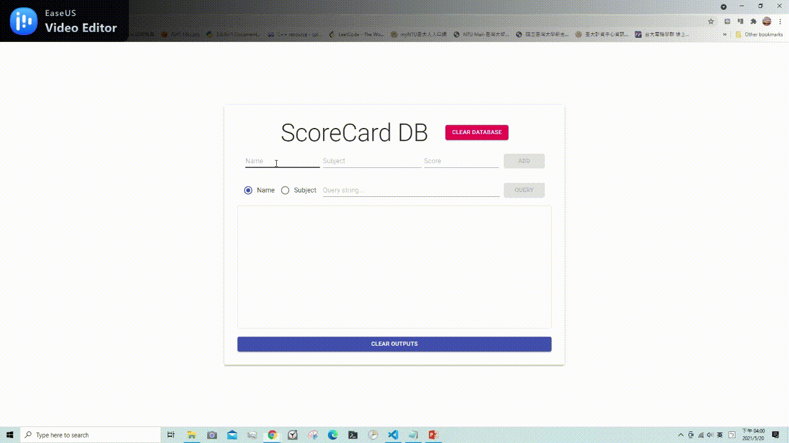

# EE 3035, Web Programming, 109-2
## Practice Homework #6: React + Axios + Express + Mongoose
### 1. usage
- client side
```
$ cd frontend
$ yarn install
$ yarn start
```

- server side (Please open another terminal first)
Please add your .env file under ./backend directory first.
```
$ cd backend
$ yarn install
$ yarn server
```

### 2. UI/UX improvement
- Add a "CLEAR OUTPUTS" button which can erase all messages

### 3. demo gif
- The following is the demo gif:


### 4. references
* [後端express路由 從req.query取值及運算](https://medium.com/@aaa24295234/%E5%BE%8C%E7%AB%AFexpress%E8%B7%AF%E7%94%B1-%E5%BE%9Ereq-query%E5%8F%96%E5%80%BC%E5%8F%8A%E9%81%8B%E7%AE%97-77101d9abe18)

* [mongoose 更新修改数据: findOneAndUpdate 的使用](https://blog.csdn.net/l_ppp/article/details/106092604)