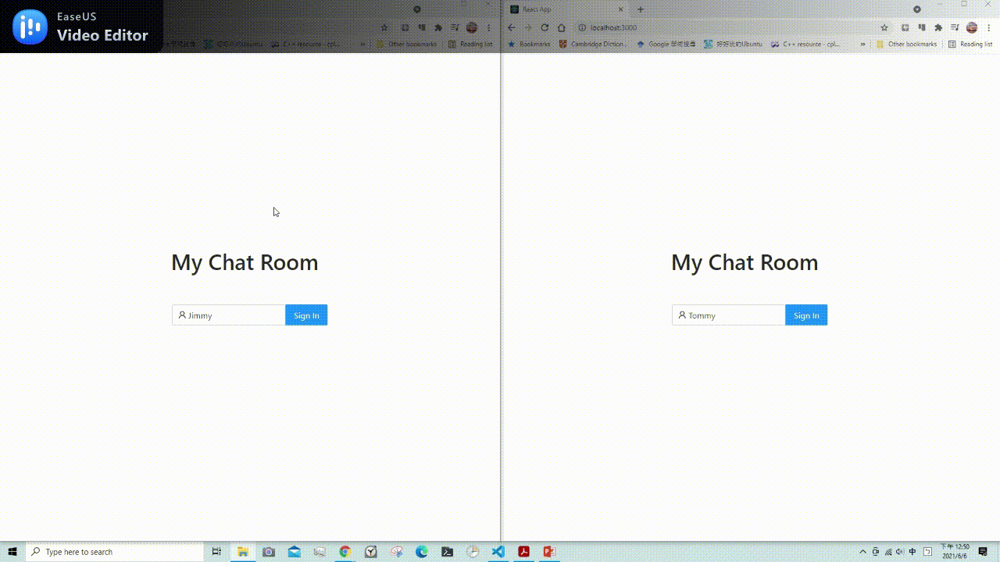

# EE 3035, Web Programming, 109-2
## Practice Homework #8: ChatRoom - GraphQL Version
### 1. Usage
- client side
1. Please open a terminal.
2. Enter the following commands:
```
$ cd frontend
$ yarn install
$ yarn start
```
3. **Please wait about 30 seconds.**

- server side 
1. Add your .env file under ./backend directory.
2. Please open another terminal.
3. Enter the following commands:
```
$ cd backend
$ yarn install
$ yarn server
```

### 2. Advance Commands
- 盡可能 cover 各種錯誤操作，並給予適當的提⽰訊息，⾄少包括：
    - 未輸入名字就按 “Sign In”
    - 未開啟任何 ChatBox 就送出訊息
    - 創建 ChatBox 時沒有輸入對話者名字，或者是與對話者之 ChatBox 已開啟 (i.e. 不可重複開啟同⼀個 ChatBox)

### 3. Demo Gif
